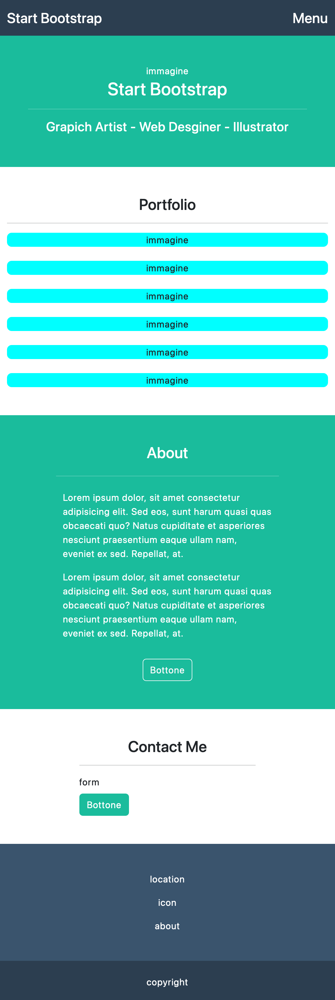
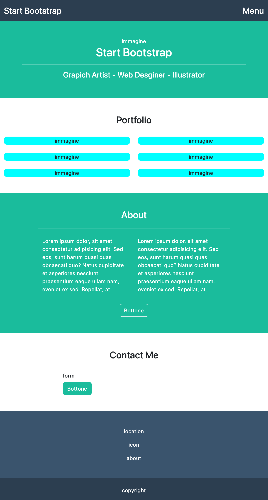
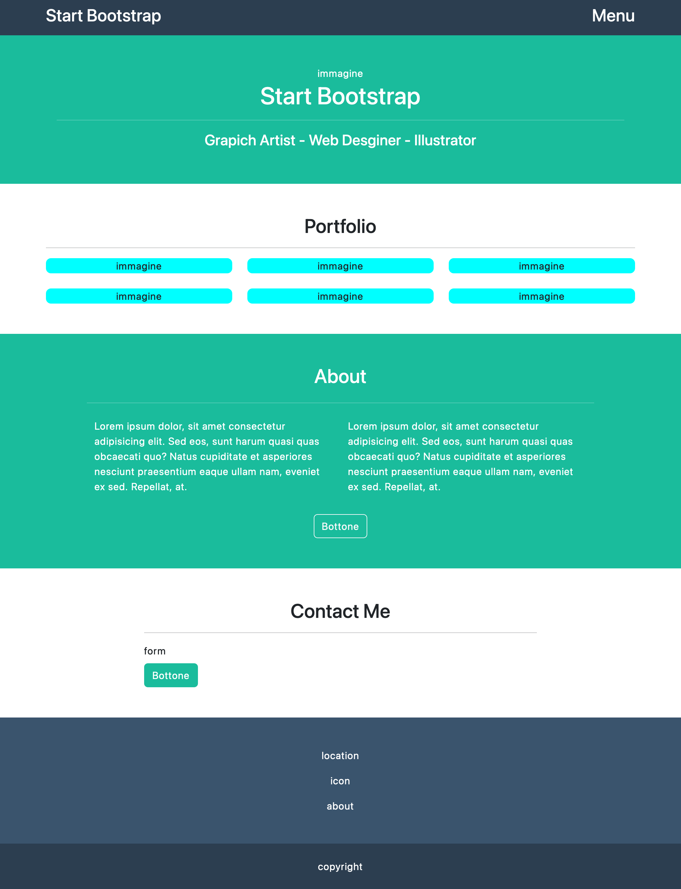

# Bootstrap Freelancer

Questo repository è dedicato al progetto Bootstrap Freelancer, un'esercitazione volta a creare una pagina web responsive utilizzando Bootstrap 5.

## Prima parte

L'obbiettivo della prima parte dell'esercizio dopo aver studiato l'utilizzo della griglia era quello di creare la struttura a blocchi responsive basata sul template fornito.

### Mobile

### Tablet

### Dekstop

